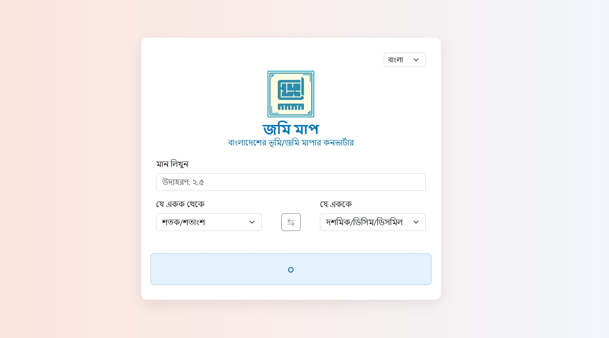

# JomiMap

**JomiMap** is a **frontend-only**, ultra-responsive web app for converting Bangladeshi land measurements between all traditional units (Bigha, Katha, Decimal, Shotok, etc.) and standard SI/Imperial units (Square Feet, Square Meter, Acre, Hectare).



---

## Features

- **Instant Conversion**: Convert any value between 20+ land units in real-time.  
- **Lightweight & Fast**: Pure HTML/CSS/JavaScript—no backend required.  
- **Mobile-First Design**: Fits full mobile viewport with minimal margins; largely scroll-free on most devices.  
- **Language Toggle**: Seamlessly switch between **English** and **বাংলা**, including localized unit names, labels, and numerals.  
- **Swap Units**: One-click swap between “From” and “To” units.  
- **Remember Preference**: Remembers last-used language in `localStorage`.  
- **Offline-Ready**: Bootstrap and dependencies are hosted locally—zero calls to third-party CDNs.  

---

## Tech Stack

- **HTML5** & **CSS3**  
- **[Bootstrap 5](css/bootstraps/bootstrap.min.css)** for layout & components (locally hosted)  
- **[Bootstrap Icons](css/bootstraps/bootstrap-icons.css)** for UI icons (locally hosted)  
- **Vanilla JavaScript** for conversion logic and localization  

---

## Installation & Running

1. **Clone this repository**:  
   ```bash
   git clone https://github.com/arkabyo/JomiMap.git
   cd JomiMap
   ```
2. **Serve `index.html`**  
    - Open `index.html` directly in your browser, or  
    - Use a local server (e.g., [VSCode Live Server](https://marketplace.visualstudio.com/items?itemName=ritwickdey.LiveServer))

3. **(Optional) Deploy**  
   - Host on **GitHub Pages**, **Netlify**, or **Firebase Hosting**—no additional configuration needed since all assets are local.  

---

## Usage

1. Open **`index.html`** in your browser.  
2. Select **language** (English/বাংলা) from the top-right dropdown.  
3. Enter a numeric value.  
4. Choose **“From Unit”** and **“To Unit”** from dropdowns.  
5. View the instant conversion result.  
6. Click the **swap icon** to reverse units.  

---

## Language & Localization

- **English**: Default on first load  
- **বাংলা**: Translated labels, unit names, and **Bengali numerals** via a digit-mapping function  
- **Preference** persists in `localStorage`  

---

## Contributing

Contributions are welcome! Feel free to:

- Report issues or suggest new units  
- Improve UI styling or accessibility  
- Add more languages or features (area calculator page, mapping overlays)  

Please fork the repo and open a PR. 👩‍💻👨‍💻

---

## 📄 License

This project is released under the [MIT License](LICENSE).

---

**Happy land measuring!** 
